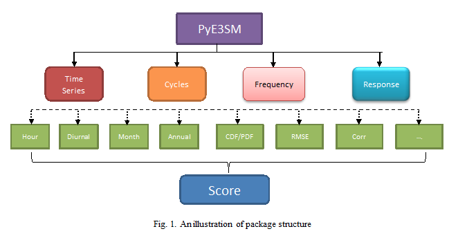
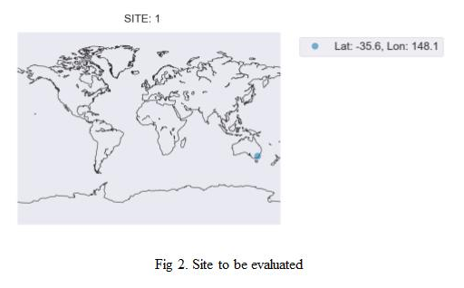
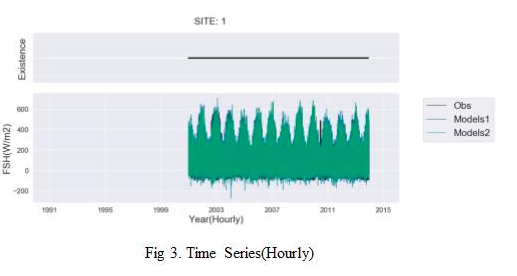
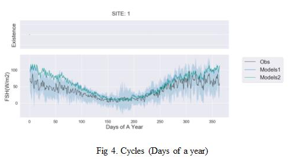
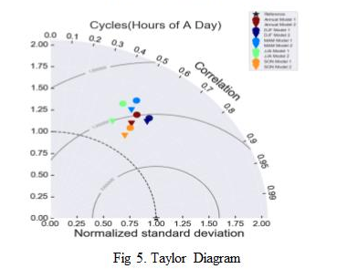
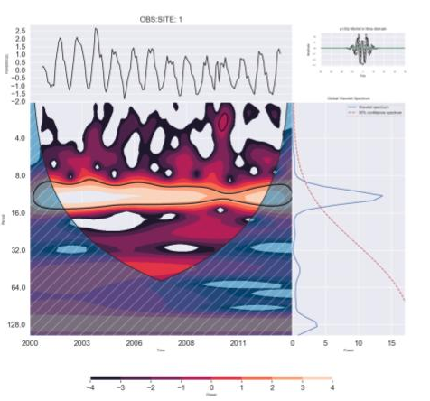

# PyE3SM

This Python Package, name PyE3SM, is established to comprehensively examine the land component of Energy Exascale Earth System Model (E3SM). The PyE3SM can be viewed as a visualization tool, which is able to provide integrated evaluation of E3SM performance for the individual variables and relationships among multiple variables. 





Mainly, PyE3SM is trying to evaluate the land models throught four aspects: Time Series, Cycle Means, Frequency, and Responses.
The package can be run directly under the environment of iLAMB, since it has been merged as a confrontation file of iLAMB.

```python 
python ConfSite2.py
python ConfSite3.py
```

Here 2, 3 defined different versions of the confrontation file, where ConfSite3.py include the usage of Pandas to further improve the accuracy and efficiency of the package.

Selective outputs of the package are listed below,







Overall, this can also be viewed as an extension for adding new metrics to iLAMB which works as the site-level component for land models' evaluations.

How to use the package, the package is building based on iLAMB with an additional depency Pandas:

All of the lats, lons of the example are listed below, which can be revised in the confsite3.py file.
```python
lat0 = np.array([47.1167, -35.6557, 51.3092, 50.3055, -2.8567,
         48.2167, 49.5026, 51.0793, 50.9636, 55.4869,
         74.4732, 61.8474, 43.7414, 5.2788, 45.9553,
         46.5878, 42.3903, 52.1679, 70.6167, 56.4917,
         72.3738, 38.3953, 42.5378, 46.0826, 41.5545,
         45.9459, 31.8214, 46.242, 38.1159, 45.5598,
         38.4067, 45.8059, 31.7365, -25.0197])
lon0 = np.array([ 11.31750011,  148.1519928 ,    4.52059984,
                  5.99679995,  -54.95890045,  -82.1556015 ,
                 18.53840065,   10.45199966,   13.56690025,
                 11.64579964,  -20.5503006 ,   24.28479958,
                  3.59579992,  -52.92490005,   11.28120041,
                 11.43470001,   11.92090034,    5.74399996,
                147.88299561,   32.9239006 ,  126.4957962 ,
               -120.63279724,  -72.17150116,  -89.97920227,
                -83.84380341,  -90.27230072, -110.8660965 ,
                -89.34770203, -120.96600342,  -84.71379852,
               -120.95069885,  -90.07990265, -109.94190216,
                 31.49690056])
```
We use the following regions to add the sites which should be included into the same habitat pattern. 
```python
        # obs = Variable(filename='/Users/lli51/Downloads/alldata/obs_FSH_model_ilamb.nc4',
        #                  variable_name="FSH")
        RegionsFile = Dataset('/Users/lli51/Desktop/IGBPa_1198.map.nc')
        
```
Additonal regions can be added by typing in the following code in the file.
```python
regions.append("tena")
        Geo_regions.append("tena")
        self.lowerlatbound.append(30.25)
        self.upperlatbound.append(49.75)
        self.lowerlonbound.append(-125.25)
        self.upperlonbound.append(-66.25)
 ```       
 
 All the variables are read in at the beginning of the confrantion function, with dataset function from netCDF4, where each file is stored seperately in each file.
 
 ```python
         v1obs = Dataset('/Users/lli51/Downloads/alldata/obs_FSH_model_ilamb.nc4')['FSH']
        v1mod1 = Dataset('/Users/lli51/Downloads/alldata/171206_ELMv0_CN_FSH_model_ilamb.nc4')['FSH']
        v1mod2 = Dataset('/Users/lli51/Downloads/alldata/171206_ELMv1_CN_FSH_model_ilamb.nc4')['FSH']

        v2obs = Dataset('/Users/lli51/Downloads/alldata/obs_GPP_model_ilamb.nc4')['GPP']
        v2mod1 = Dataset('/Users/lli51/Downloads/alldata/171206_ELMv0_CN_GPP_model_ilamb.nc4')['GPP']
        v2mod2 = Dataset('/Users/lli51/Downloads/alldata/171206_ELMv1_CN_GPP_model_ilamb.nc4')['GPP']

        v3obs = Dataset('/Users/lli51/Downloads/alldata/obs_NEE_model_ilamb.nc4')['NEE']
        v3mod1 = Dataset('/Users/lli51/Downloads/alldata/171206_ELMv0_CN_NEE_model_ilamb.nc4')['NEE']
        v3mod2 = Dataset('/Users/lli51/Downloads/alldata/171206_ELMv1_CN_NEE_model_ilamb.nc4')['NEE']

        v4obs = Dataset('/Users/lli51/Downloads/alldata/obs_ER_model_ilamb.nc4')['ER']
        v4mod1 = Dataset('/Users/lli51/Downloads/alldata/171206_ELMv0_CN_ER_model_ilamb.nc4')['ER']
        v4mod2 = Dataset('/Users/lli51/Downloads/alldata/171206_ELMv1_CN_ER_model_ilamb.nc4')['ER']
        times = Dataset('/Users/lli51/Downloads/alldata/obs_FSH_model_ilamb.nc4')['time']
 ```
The example output of the package can be found below:
[Webpage CERES.html](http://volweb.utk.edu/~lli51/ol2/CERES.html)

Please cite our coming paper,

Liang Li, Jiafu Mao, Daniel M. Ricciuto, "Developing a site-level diagnostic package for the land component of E3SM"

